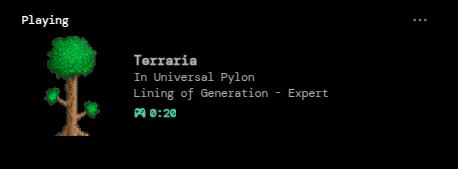
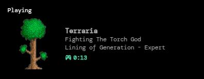
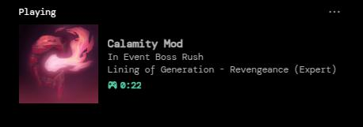
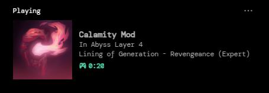
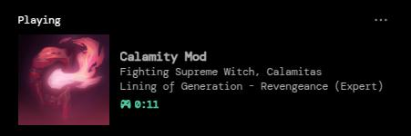

# Melina

RPCMod is a Terraria mod that adds rich presence functionality to the game, allowing players to showcase their in-game status on Discord.

---

## 🖼️ Preview

<h3>Vanilla</h3>

<table>
  <tr>
    <td></td>
    <td></td>
  </tr>
  <tr>
    <td></td>
    <td></td>
  </tr>
</table>

<h3>Calamity Mod </h3>

<table>
  <tr>
    <td></td>
    <td></td>
  </tr>
  <tr>
    <td></td>
    <td></td>
  </tr>
</table>

---

### 🎮 Features
- Boss Tracker  
- Biome Tracker  
- Events Tracker  
- World Name / Difficulty Display  

---

### 📦 Supported Mods
- **Calamity Mod**
  + Biomes: Sulphuric Sea, The Abyss, The Sunken Sea, Brimstone & Astral Infection  
  + Bosses: All Bosses  
  + Events: Boss Rush, Acid Rain  

---

### 🔮 Planned Supported Mods
- Thorium Mod  
- Fargo's Mod  
- Starlight River Mod  

---

## 🛠 Installation

1. Download the latest release from the [Releases page](https://github.com/0xsh1n/Melina/releases)  
2. Place the `.tmod` file in your `Terraria/ModLoader/Mods` folder  
3. Launch Terraria with tModLoader enabled  
4. Enable the mod in the Mods menu  

---

### 🧪 Compatibility
- **Windows** – Not yet tested  
- **Linux** – Fully working  
  > ⚠️ **Note:** You must use the **non-Flatpak** version of Discord.

---

### 📚 Credits

- This mod uses [Discord RPC for C#](https://github.com/Lachee/discord-rpc-csharp) by [Lachee](https://github.com/Lachee)  
